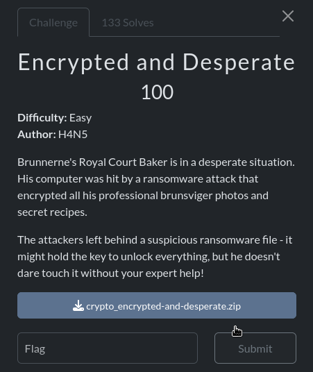

In this challenge they gave us the followning python script

```py
import os
from pathlib import Path
from itertools import cycle

TARGET_DIR = Path("./recipes/")

def encrypt(file: Path, key: bytes) -> None:
    with open(file, "rb") as f:
        plaintext = f.read()

    ciphertext = bytes(a ^ b for a, b in zip(plaintext, cycle(key)))

    with open(f"{file}.enc", "wb") as f:
        f.write(ciphertext)

    print(f"Encrypted {file.name}")
    file.unlink() # delete original file, so he can't use it 


if __name__=="__main__":
    key = os.urandom(16)
    print(f"Key: {key.hex(" ")}\n")

    print("Encrypting files...")
    for file in TARGET_DIR.rglob("*"):
        if file.is_file():
            encrypt(file, key)

```
And a directory containing a bunch of different file type(pdf, docx , png ,...) encrypted by this using the above script

We need to recover the key and decrypt all the files to obtain the flag. Since the files are encrypted using a 16-byte XOR key and we know the PNG file’s magic number, we can recover the key by XOR-ing the first 16 bytes of an encrypted image with the corresponding 16 bytes of the PNG magic number.

```py
import os
from pathlib import Path
from itertools import cycle
from pwn import xor

TARGET_DIR = Path(".")

def decrypt(file: Path, key: bytes) -> None:
    with open(file, "rb") as f:
        ct = f.read()

    pt = xor(ct,key)

    with open(f"new_{file}", "wb") as f:
        f.write(pt)

    print(f"Encrypted {file}")
    file.unlink() # delete original file, so he can't use it 


if __name__=="__main__":
    header_png=bytes.fromhex("89504E470D0A1A0A0000000D49484452")
    with open("1f.png.enc", "rb") as f:
        ct = f.read()
    key = xor(header_png,ct[:16])
    

    print("DEcrypting files...")
    for file in TARGET_DIR.rglob("*"):
        if file.is_file():
            decrypt(file, key)

```
and I found the flag in a pdf file after I decrypt it's content `brunner{mY_pr3c10u5_r3c1p35_U_f0und_7h3m}`

