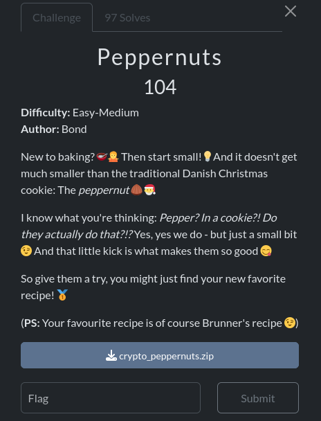

In this challenge we get three files : a large python script flooded by comments , two csv files containing hashes of passwords and other information.

I first gives the python script to chatGPT so it can clean it up and delete the comments.

```py
import secrets
from hashlib import sha256
from argon2 import PasswordHasher
from cryptography.hazmat.primitives.ciphers.aead import AESGCM
from cryptography.hazmat.primitives.kdf.hkdf import HKDF
from cryptography.hazmat.primitives import hashes
from argon2.low_level import hash_secret_raw, Type

# ---------------------------
# 1. Pepper creation & retrieval
# ---------------------------

def create_pepper():
    """Generate a secure 16-byte pepper and store it in a file."""
    pepper = secrets.token_hex(16)
    with open('secret.txt', 'w') as f:
        f.write(pepper)

def get_pepper() -> str:
    """Read the stored pepper."""
    with open('secret.txt', 'r') as f:
        return f.read()

# ---------------------------
# 2. Password hashing
# ---------------------------

def password_hash(password: str) -> str:
    """Hash password securely with a pepper and SHA256 + Argon2."""
    pepper = get_pepper()
    ph = sha256((pepper + ":" + password).encode()).hexdigest()
    # Optionally: further Argon2 hashing if storing
    return ph

# ---------------------------
# 3. Password validation
# ---------------------------

def validate_password(password: str) -> str:
    """Check password strength; raise ValueError if weak."""
    requirements = {
        1: "Password must be >= 8 characters",
        2: "Password must contain a digit",
        3: "Password must contain an uppercase letter",
        4: "Password must contain a special character"
    }
    failed = []
    if len(password) < 8: failed.append(1)
    if not any(c.isdigit() for c in password): failed.append(2)
    if not any(c.isupper() for c in password): failed.append(3)
    if not any(not c.isalnum() for c in password): failed.append(4)

    if failed:
        raise ValueError("Password failed the following checks:\n" +
                         "\n".join([requirements[i] for i in failed]))
    return password

# ---------------------------
# 4. Data encryption / decryption
# ---------------------------

def encrypt_data(data: str, nonce: str, password: str, hash_salt: str, key_salt: str, decrypt=False) -> str:
    """
    Encrypt or decrypt data with AES-256-GCM, using a key derived from password + salts.
    """
    # Derive key from password using Argon2
    argon2_hash = hash_secret_raw(
        secret=password.encode(),
        salt=bytes.fromhex(hash_salt),
        time_cost=5,
        memory_cost=262144,
        parallelism=4,
        hash_len=64,
        type=Type.ID
    )

    # Derive AES key from Argon2 hash using HKDF-SHA256
    hkdf = HKDF(
        algorithm=hashes.SHA256(),
        length=32,
        salt=bytes.fromhex(key_salt),
        info=b'user-data-encryption'
    )
    key = hkdf.derive(argon2_hash)

    aesgcm = AESGCM(key)
    nonce_bytes = bytes.fromhex(nonce)
    data_bytes = bytes.fromhex(data)

    if decrypt:
        return aesgcm.decrypt(nonce_bytes, data_bytes, None).hex()
    else:
        return aesgcm.encrypt(nonce_bytes, data_bytes, None).hex()

```
All seems strong. This is a script that hashes the password of users along with a salt of 16 bytes and then encrypt each users's data with the corresponding hash using AES-GCM. What I miss is that in the comments there is clue that will help us bruteforce the salt  "like how the test with password="Test123!" at this point had the value of ph be:'8b56d663500f6f36f7b2f329cbcfe65851b146df3567e0b2fcf896391d641b7f'...". So basically this give us the following equation : `hash(salt:Test123!)=8b56d663500f6f36f7b2f329cbcfe65851b146df3567e0b2fcf896391d641b7f` 


```py
import secrets
from hashlib import sha256

target_hash = "8b56d663500f6f36f7b2f329cbcfe65851b146df3567e0b2fcf896391d641b7f"
password = "Test123!"
while True:
    pepper = hex(secrets.randbits(16))[2:]
    if sha256(f"{pepper}:{password}".encode()).hexdigest()==target_hash:
        print("salt :",pepper)
        break
```
`salt : e9d8`

    Alice,2db81a83a2038e68795e78e1fffaf2d7270ae18fe2ae99bfe6a8beb5823b8df9
    Brunner,5e2b36351799d86e074d9c3344b789da448f3de1f0c5218332f1eaa9bfc083e9
    Claude,7e9eb12eae8c949bfef7aca8c4a9858c5555811aa80d212211d10b9b714b047c
    Dud,9d1a04b41fba1a699c291df1bad30913d78293c7224439535c88459f4ffcbf9c
    Emul,9d1a04b41fba1a699c291df1bad30913d78293c7224439535c88459f4ffcbf9c
    Frank,d1af4f9df518a7f1ad8bfd4a3e92acc1fc4725af7e976d49023f90a42f608ea5A
    
Now since we have the salt we can try an bruteforce the password hashes we have using tool like hashcat and the rockyou wordlist. I preapare the file from the given password hashes(passwords.csv) for hascat(the latter don't add ":" so I need to add it as apart of the salt

    2db81a83a2038e68795e78e1fffaf2d7270ae18fe2ae99bfe6a8beb5823b8df9:e9d8:
    5e2b36351799d86e074d9c3344b789da448f3de1f0c5218332f1eaa9bfc083e9:e9d8:
    7e9eb12eae8c949bfef7aca8c4a9858c5555811aa80d212211d10b9b714b047c:e9d8:
    9d1a04b41fba1a699c291df1bad30913d78293c7224439535c88459f4ffcbf9c:e9d8:
    d1af4f9df518a7f1ad8bfd4a3e92acc1fc4725af7e976d49023f90a42f608ea5:e9d8:

And I use the following command : `hashcat -O -a 0 -m 1420 hashes.txt /usr/share/wordlists/rockyou.txt -r /usr/share/hashcat/rules/best64.rule`

hashcat cracked 4/5 hashes(except the password for the user Claude): and gives the following results:

    2db81a83a2038e68795e78e1fffaf2d7270ae18fe2ae99bfe6a8beb5823b8df9:e9d8::gfedcba
    5e2b36351799d86e074d9c3344b789da448f3de1f0c5218332f1eaa9bfc083e9:e9d8::abcake
    9d1a04b41fba1a699c291df1bad30913d78293c7224439535c88459f4ffcbf9c:e9d8::dud
    d1af4f9df518a7f1ad8bfd4a3e92acc1fc4725af7e976d49023f90a42f608ea5:e9d8::letmein

Now I will try to decrypt the data with the cracked password using the same script they used for encryption and see if any message contains the flag

We found the flag in the message of the user brunner : 
`brunner{Maybe_we_could_mould_some_small_pieces_of_brunsviger_into_peppernut-shaped_treats?_:-D}`


