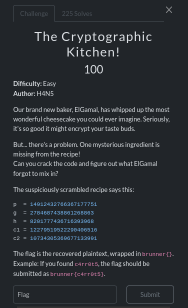

It's El-Gamal cryptosystem. But the parameter are too small so we can caclculate the discrete log effeicintly using Pohlib-hellman algo and get the flag.

```sage
# ElGamal parameters
p  = 14912432766367177751
g  = 2784687438861268863
h  = 8201777436716393968
c1 = 12279519522290406516
c2 = 10734305369677133991

# Create the group modulo p
R = Integers(p)

# Compute discrete log x = log_g(h)
x = R(h).log(g)  

# Compute shared secret s = c1^x mod p
s = pow(c1, x, p)

# Decrypt message
m = (c2 * pow(s, -1, p)) % p

print(m)

```

```py
from Cryptodome.Util.number import long_to_bytes

m = 108256065500018

flag = "brunner{"+long_to_bytes(m).decode()+"}"
print(flag) #brunner{buTT3r}
```

