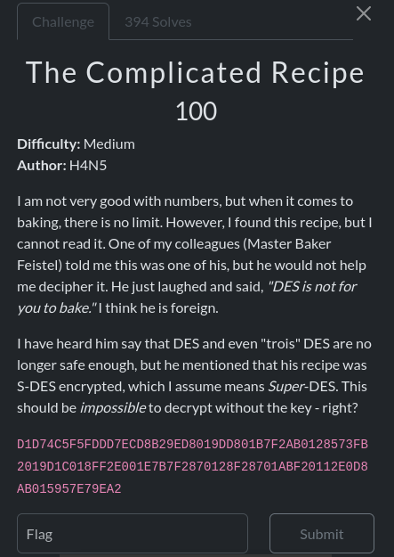

This challenge is relatively easy. The flag is encrypted using SDES (Simplified Data Encryption Standard), which relies on a 10-bit key to derive two 8-bit subkeys. Since the key space is only 1024 possibilities, the algorithm is very weak. Therefore, we can simply brute-force the key to recover the flag.

```py
import sdes
import bitarray

ct=bytes.fromhex("D1D74C5F5FDDD7ECD8B29ED8019DD801B7F2AB0128573FB2019D1C018FF2E001E7B7F2870128F28701ABF20112E0D8AB015957E79EA2")
for test in range(1024):
    pt=""
    key = bitarray.bitarray(bin(test)[2:].zfill(10))
    key1,key2 = sdes.generate_keys(key)
    for ch in ct:
        byte=bitarray.bitarray(bin(ch)[2:].zfill(8))
        pt+=chr(sdes.decrypt(byte,key1,key2).tobytes()[0])
    if "brunner" in pt:
        print("the key was :",key) # the key was : bitarray('1110010010')
        print("the flag is :",pt) # the flag is : brunner{5D35_15_N0T_H4RD_1F_Y0U_KN0W_H0W_T0_JU5T_B4K3}
        break
```

