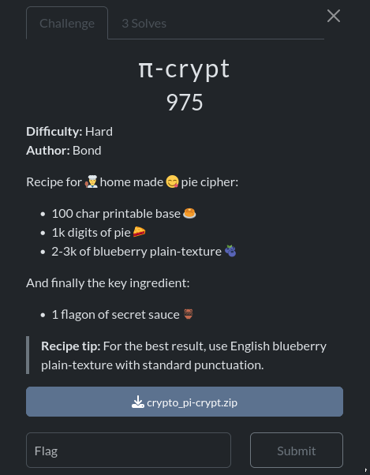

Challenge with only 3 solves!

This was quite an interesting challenge because, although the cipher itself works in a rather simple way, cracking it turned out to be difficult, especially since we were given only the ciphertext, placing us in a ciphertext-only attack model.

I didn’t manage to solve the challenge during the competition, but I came very close. After the event, I went back to study some talks about it, picked up a few useful ideas that I had missed during my initial attempt, and finally managed to solve the challenge.

pi-crypt is a custom cryptographic algorithm that uses the first 1,000 digits of π and a key to shift the characters of a message. The scheme operates over a set of 100 printable characters.

We got three files : the script of the cipher , he ciphertext and the pi digits.

```py
base = "ABCDEFGHIJKLMNOPQRSTUVWXYZabcdefghijklmnopqrstuvwxyz0123456789æøåÆØÅ .,!?-:()[]/{}=<>+_@^|~%$#&*`“';"

with open('unbaked_pi.txt') as f:
    pie = f.read()

assert len(base) == 100 and len(pie) == 1000

def pie_crypt(text: str, key: str, decrypt: bool=False) -> str:
    out = ""
    i = sum(base.index(c) for c in key)
    j = 0

    for c in text:
        d1 = int(pie[i % len(pie)])
        i += base.index(key[j % len(key)])
        j += 1

        d2 = int(pie[i % len(pie)])
        i += base.index(key[j % len(key)])
        j += 1

        shift = 10 * d1 + d2
        out += base[(base.index(c) + (-shift if decrypt else shift)) % len(base)]

    return out


from secret import text, flag
assert all(c in base for c in text+flag) and flag[:8] + flag[-1] == 'brunner{}'

with open('baked_pie.txt', 'w', encoding="utf-8") as f:
    f.write(pie_crypt(text, flag))
```
This cipher uses a custom shift system based on a 100-character alphabet (base) and a 1000-digit string (pie). For each character in the plaintext, it generates a shifting value derived from two digits of pie, which are indexed using both the cumulative position and the numeric values of the key’s characters. Each round, the cipher reads two digits from pie, combines them into a two-digit number (d1d2), and uses that as the shift amount. The plaintext character is then mapped to its position in base, shifted forward by that amount (or backward during decryption), and wrapped around modulo 100. This effectively turns the algorithm into a variant of a polyalphabetic Caesar cipher, where the shifts are not static but depend on both the secret key and the pie digits, making the encryption dynamic and non-repeating.

The goal is to recover the key used for encryption which represents the flag.

The solve for this challenge go through 3 steps : 

### 1 - Determine the i0, initial value of i


