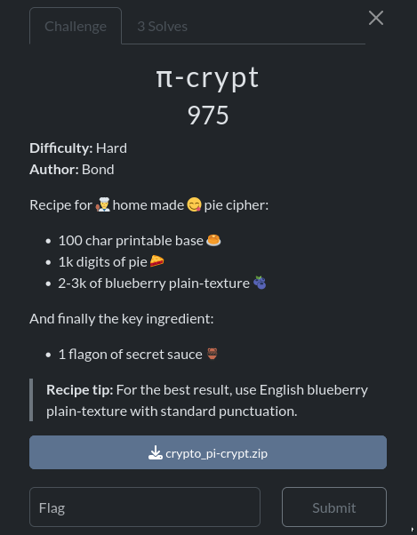
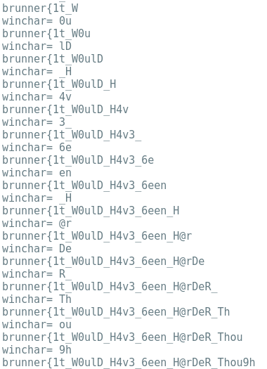

Challenge with only 3 solves!

This was quite an interesting challenge because, although the cipher itself works in a rather simple way, cracking it turned out to be difficult, especially since we were given only the ciphertext, placing us in a ciphertext-only attack model.

I didn’t manage to solve the challenge during the competition, but I came very close. After the event, I went back to study some talks about it, picked up a few useful ideas that I had missed during my initial attempt, and finally managed to solve the challenge.

pi-crypt is a custom cryptographic algorithm that uses the first 1,000 digits of π and a key to shift the characters of a message. The scheme operates over a set of 100 printable characters.

We got three files : the script of the cipher , the ciphertext and the pi digits.

```py
base = "ABCDEFGHIJKLMNOPQRSTUVWXYZabcdefghijklmnopqrstuvwxyz0123456789æøåÆØÅ .,!?-:()[]/{}=<>+_@^|~%$#&*`“';"

with open('unbaked_pi.txt') as f:
    pie = f.read()

assert len(base) == 100 and len(pie) == 1000

def pie_crypt(text: str, key: str, decrypt: bool=False) -> str:
    out = ""
    i = sum(base.index(c) for c in key)
    j = 0

    for c in text:
        d1 = int(pie[i % len(pie)])
        i += base.index(key[j % len(key)])
        j += 1

        d2 = int(pie[i % len(pie)])
        i += base.index(key[j % len(key)])
        j += 1

        shift = 10 * d1 + d2
        out += base[(base.index(c) + (-shift if decrypt else shift)) % len(base)]

    return out


from secret import text, flag
assert all(c in base for c in text+flag) and flag[:8] + flag[-1] == 'brunner{}'

with open('baked_pie.txt', 'w', encoding="utf-8") as f:
    f.write(pie_crypt(text, flag))
```
This cipher uses a custom shift system based on a 100-character alphabet (base) and a 1000-digit string (pie). For each character in the plaintext, it generates a shifting value derived from two digits of pie, which are indexed using both the cumulative position and the numeric values of the key’s characters. Each round, the cipher reads two digits from pie, combines them into a two-digit number (d1d2), and uses that as the shift amount. The plaintext character is then mapped to its position in base, shifted forward by that amount (or backward during decryption), and wrapped around modulo 100. This effectively turns the algorithm into a variant of a polyalphabetic Caesar cipher, where the shifts are not static but depend on both the secret key and the pie digits, making the encryption dynamic and non-repeating.

The goal is to recover the key used for encryption which represents the flag.

From the challenge description, we can assume that the plaintext is composed of English words, which is a key advantage for solving it. The solution can be broken down into three main steps :

### 1 - Determine the i0, initial value of i

The only way to that is by bruteforce. Go throught all the values from 0 to 999 and see if the output gives something readable.

```py
def check(s: str) -> bool:
    return s.isalpha() and (s.islower() or s.isupper() or s.istitle()) and not any(c in s for c in "æøåÆØÅ")

# Try to guess starting point of i
flag = "brunner{"
for i in range(1000):
    pt = pie_crypt(ct[:4], flag, i,decrypt=True)
    if check(pt[:4]):
        print(i, pt[:10])

i0 = 765
```
Since only 8 characters of the key(flag) are revealed, we can decrypt just the first 4 characters of the ciphertext. To reduce the number of possible candidates, I applied a filtering function: the result must be alphabetic, consistently cased (all lowercase, all uppercase, or title case), and must not contain any of the special characters æøåÆØÅ. After applying this filter, only 8 candidates remain, one of them is "Blue", so we select the corresponding index i used as i0.

### 2 - Determine the length of the key

Before attempting to recover the flag, it is essential to determine its length. Since the cipher repeatedly cycles over the key when encrypting the plaintext, every few positions we can correctly decrypt 4 consecutive characters. By leveraging the most common English bigrams, we can brute-force the key length and identify the correct one.

```py
#Count how much the first 200 most frequent english bi-grams appears in a text
def count_bigram(r):
    t=0
    for bg in bigrams:
        t+=r.count(bg)
    return t

for l in range(100):
    key = flag + "a"*l
    pt = pie_crypt(ct, key, decrypt=True, i=i0)
    known = [ pt[(j * len(key) + 1) // 2:(j * len(key) + 1) // 2 + 4] for j in range(2 * len(pt) // len(key)) ] # builds a list of all 4-character segments after each reuse of the key.
    text = " ".join(known)
    score = count_bigram(text)/len(text)
    if l==0:
        max = score
        winner = len(key)
    else :
        if score>max:
            max = score
            winner = len(key)
print("flag's length is :",winner)
``` 
In this step, we try to recover the flag’s length by brute-forcing different possibilities. For each candidate length `l`, we extend the known part of the flag with padding characters `"a"*l` and attempt decryption. Since the cipher cycles over the key, this produces several short `4-character` chunks of plaintext. We then join these chunks and score the result using a bigram frequency check `count_bigram`, which counts how many common English bigrams appear in the text. The assumption is that the correct key length will produce more natural English-like fragments, thus achieving a higher bigram score. By keeping track of the best-scoring candidate, we can estimate the actual length of the flag. At the end we find out that the key length is 75.

### 3 - Determine the key(flag)

We'll use the same technique as `2`.

```py
for k in range((75-len(flag))//2):
    winChar = ""
    i=-1
    for char in product(base,repeat=2):

        key = flag + "".join(char) +"a"*(75-len(flag)-3) + "}"
        pt = pie_crypt(ct, key, i0,decrypt=True)
        known = [
        pt[(j * len(key) + 1) // 2:(j * len(key) + 1) // 2 + (len(flag)+2) // 2]
        for j in range(2 * len(pt) // len(key))
        ]
        t=" ".join(known)
        if any(c in t for c in "æøåÆØÅ"):
            continue
        i+=1

        test = count_bigram(t)/len(t)
        if i==0:
            max = test
            winChar = "".join(char)
        else :
            if test>max:
                max = test
                winChar = "".join(char)
    print("winchar=",winChar)
    flag+=winChar
    print(flag)
```

This part of the solve incrementally recovers the unknown characters of the flag two at a time. For each iteration, it tries every possible pair of characters from the `base` and inserts them into the current flag guess, padding the rest with filler characters (a...}). The candidate key is then used to decrypt the ciphertext, and from the resulting plaintext we extract aligned fragments with half of the size of the actual recovered key + the two added candidates chars from base (using the same slicing trick as before). These fragments are concatenated and scored with the bigram frequency function to measure how “English-like” they are. Any candidate producing forbidden symbols (æøåÆØÅ) is discarded immediately. Among the remaining candidates, the pair of characters that yields the highest bigram score is chosen as the correct extension of the flag. This process is repeated in a loop, gradually appending two characters per round until the full flag is recovered.




