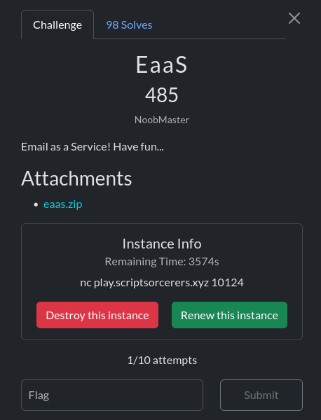
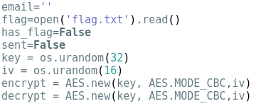
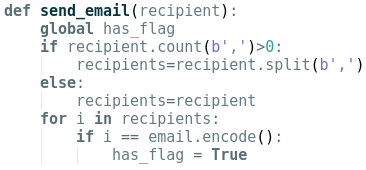
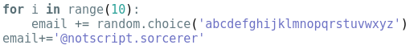
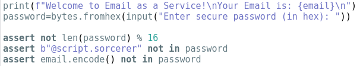
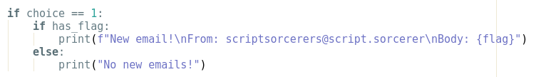
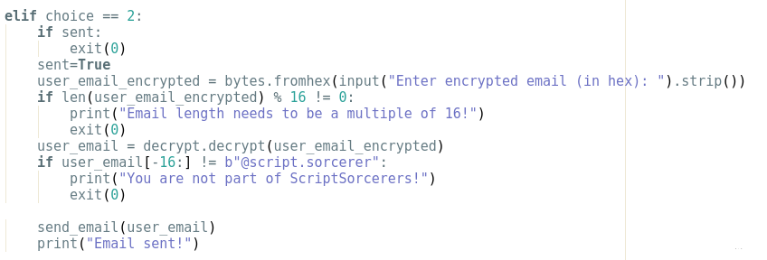

This is the best and thoughest crypto chall from the compition.

They provide us with the source code of the server :

```python
#!/usr/bin/env python3
from Crypto.Cipher import AES
from Crypto.Util.Padding import pad, unpad
import os
import random
email=''
flag=open('flag.txt').read()
has_flag=False
sent=False
key = os.urandom(32)
iv = os.urandom(16)
encrypt = AES.new(key, AES.MODE_CBC,iv)
decrypt = AES.new(key, AES.MODE_CBC,iv)

def send_email(recipient):
    global has_flag
    if recipient.count(b',')>0:
        recipients=recipient.split(b',')
    else:
        recipients=recipient
    for i in recipients:
        if i == email.encode():
            has_flag = True

for i in range(10):
    email += random.choice('abcdefghijklmnopqrstuvwxyz')
email+='@notscript.sorcerer'

print(f"Welcome to Email as a Service!\nYour Email is: {email}\n")
password=bytes.fromhex(input("Enter secure password (in hex): "))

assert not len(password) % 16
assert b"@script.sorcerer" not in password
assert email.encode() not in password

encrypted_pass = encrypt.encrypt(password)
print("Please use this key for future login: " + encrypted_pass.hex())

while True:
    choice = int(input("Enter your choice: "))
    print(f"[1] Check for new messages\n[2] Get flag")

    if choice == 1:
        if has_flag:
            print(f"New email!\nFrom: scriptsorcerers@script.sorcerer\nBody: {flag}")
        else:
            print("No new emails!")

    elif choice == 2:
        if sent:
            exit(0)
        sent=True
        user_email_encrypted = bytes.fromhex(input("Enter encrypted email (in hex): ").strip())
        if len(user_email_encrypted) % 16 != 0:
            print("Email length needs to be a multiple of 16!")
            exit(0)
        user_email = decrypt.decrypt(user_email_encrypted)
        if user_email[-16:] != b"@script.sorcerer":
            print("You are not part of ScriptSorcerers!")
            exit(0)

        send_email(user_email)
        print("Email sent!")


```
It seems too large, but don't worry I will try to explain what it does step by step



In this section, a set of variables is defined. We can see that the server will use AES-CBC for encryption with a securely generated random key and IV, but this mode is vulnerable to some attacks like bit flipping. There is also two interesting boolean variables, has_flag and sent, are both initialized to false. These might play a crucial role in discovering the flag. 



The send_email function takes a byte string representing a recipient email (or a comma-separated list of recipients) and iterates through it. If any entry exactly matches the user’s assigned email, it sets the global has_flag variable to True.



This function assign a random email address ending in @notscript.sorcerer to the user.



User must provide a password in hex. Three restrictions:

   - Must be a multiple of 16 bytes (AES block size).

   - Cannot directly contain @script.sorcerer.

   - Cannot contain your assigned email

After that the server gave you two options :

- option 1:
  


The server checks the value of has_flag: if it is True, it prints the flag; otherwise, it prints “No new emails.” This means we need to trigger the server to execute the send_email function and satisfy its conditions in order to set has_flag to True. The question then becomes: where in the code is send_email called, and under what circumstances? We'll see.

- option 2:
  


The server decrypts any ciphertext provided by the user. It first checks that the input length is a multiple of 16 bytes and that the last 16 bytes equal `@script.sorcerer` to verify the correct domain. If both conditions are satisfied, it calls `send_email()`. The `sent` variable simply prevents option 2 from being used more than once. Therefore, our goal is to craft input that makes the server execute `send_email()` while fulfilling all its requirements.

In summary, the server workflow is as follows:

1. A random email is generated and assigned to the user.  
2. The server asks for a password in hex, which it encrypts and returns.  
3. The user chooses an option:  
   - **Option 1:** Checks the `has_flag` variable and returns the flag if it is `True`.  
   - **Option 2:** Requests a hex string, decrypts it, and checks two conditions: the length must be a multiple of 16, and the last 16 bytes must equal `@script.sorcerer`. If valid, it calls `send_email()`, which verifies if the assigned email exists among the recipients and sets `has_flag = True`.

To solve the challenge, we need to craft a password that meets the constraints, then submit it for encryption. Using a **CBC bit-flipping attack**, we can modify the ciphertext so that, upon decryption, it satisfies all conditions: ends with `@script.sorcerer` and contains the assigned email. This triggers `send_email()` and sets `has_flag`, allowing us to retrieve the flag.


