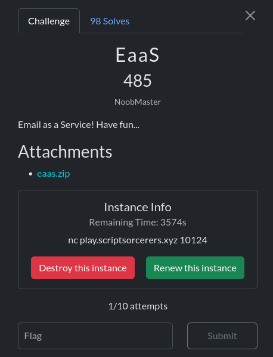

### This is the best and thoughest crypto chall from the competition.

# Recon
They provide us with the source code of the server.

```python
#!/usr/bin/env python3
from Crypto.Cipher import AES
from Crypto.Util.Padding import pad, unpad
import os
import random
email=''
flag=open('flag.txt').read()
has_flag=False
sent=False
key = os.urandom(32)
iv = os.urandom(16)
encrypt = AES.new(key, AES.MODE_CBC,iv)
decrypt = AES.new(key, AES.MODE_CBC,iv)

def send_email(recipient):
    global has_flag
    if recipient.count(b',')>0:
        recipients=recipient.split(b',')
    else:
        recipients=recipient
    for i in recipients:
        if i == email.encode():
            has_flag = True

for i in range(10):
    email += random.choice('abcdefghijklmnopqrstuvwxyz')
email+='@notscript.sorcerer'

print(f"Welcome to Email as a Service!\nYour Email is: {email}\n")
password=bytes.fromhex(input("Enter secure password (in hex): "))

assert not len(password) % 16
assert b"@script.sorcerer" not in password
assert email.encode() not in password

encrypted_pass = encrypt.encrypt(password)
print("Please use this key for future login: " + encrypted_pass.hex())

while True:
    choice = int(input("Enter your choice: "))
    print(f"[1] Check for new messages\n[2] Get flag")

    if choice == 1:
        if has_flag:
            print(f"New email!\nFrom: scriptsorcerers@script.sorcerer\nBody: {flag}")
        else:
            print("No new emails!")

    elif choice == 2:
        if sent:
            exit(0)
        sent=True
        user_email_encrypted = bytes.fromhex(input("Enter encrypted email (in hex): ").strip())
        if len(user_email_encrypted) % 16 != 0:
            print("Email length needs to be a multiple of 16!")
            exit(0)
        user_email = decrypt.decrypt(user_email_encrypted)
        if user_email[-16:] != b"@script.sorcerer":
            print("You are not part of ScriptSorcerers!")
            exit(0)

        send_email(user_email)
        print("Email sent!")


```
It seems too large, but don't worry I will try to explain what it does step by step

### 1 - Global Variables
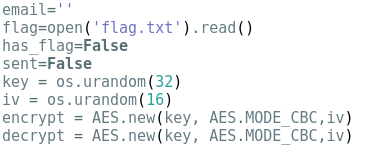

In this section, a set of variables is defined. We can see that the server will use `AES-CBC` for encryption and decryption with a securely generated random key and IV, but this mode is vulnerable to some attacks like `bit flipping`. There is also two interesting boolean variables, has_flag and sent, are both initialized to false. These might play a crucial role in discovering the flag. 
### 2 - send_email function
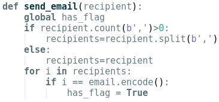

The `send_email` function takes a byte string representing a recipient email (or a comma-separated list of recipients) and iterates through it. If any entry exactly matches the user’s assigned email, it sets the global has_flag variable to `True`.
### 3 - Email generation
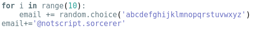

This function assign a random email address ending in @notscript.sorcerer to the user.
### 4 - Password's restrictions
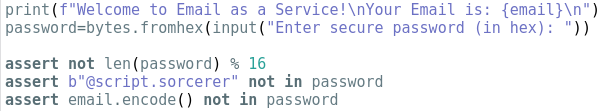

User must provide a password in hex. Three restrictions:

   - Must be a multiple of 16 bytes (AES block size).

   - Cannot directly contain @script.sorcerer.

   - Cannot contain your assigned email
### 5 - Options
After that the server gave you two options :

- option 1:
  
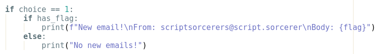

The server checks the value of has_flag: if it is True, it prints the flag; otherwise, it prints “No new emails.” This means we need to trigger the server to execute the `send_email` function and satisfy its conditions in order to set has_flag to True. The question then becomes: where in the code is `send_email` called, and under what circumstances? We'll see.

- option 2:
  
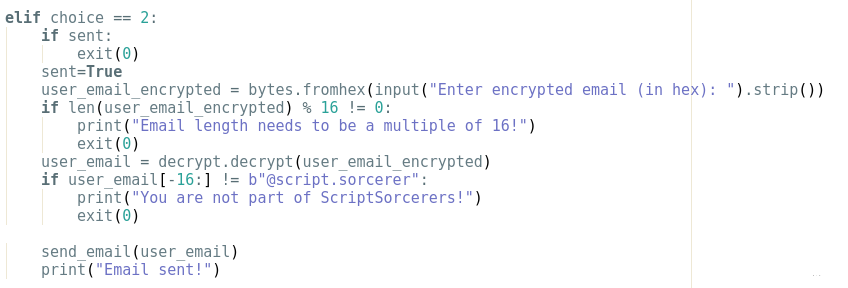

The server decrypts any ciphertext provided by the user. It first checks that the input length is a multiple of 16 bytes and that the last 16 bytes equal `@script.sorcerer` to verify the correct domain. If both conditions are satisfied, it calls `send_email()`. The `sent` variable simply prevents option 2 from being used more than once. Therefore, our goal is to craft input that makes the server execute `send_email()` while fulfilling all its requirements.

In summary, the server workflow is as follows:

1. A random email is generated and assigned to the user.  
2. The server asks for a password in hex, which it encrypts and returns.  
3. The user chooses an option:  
   - **Option 1:** The server checks the `has_flag` variable and returns the flag if it is `True`.  
   - **Option 2:** The server requests a hex string, decrypts it, and checks two conditions: the length must be a multiple of 16, and the last 16 bytes must equal `@script.sorcerer`. If valid, it calls `send_email()`, which verifies if the assigned email exists among the recipients and sets `has_flag = True`.
     
# The attack theory

To solve the challenge, we need to craft a password that meets the constraints(maybe we can change one char from both string "@script.sorcerer" and the email and put them in the password), then submit it for encryption. Using a **CBC bit-flipping attack**, we can modify the ciphertext so that, upon decryption, it satisfies all conditions: ends with `@script.sorcerer` and contains the assigned email. This triggers `send_email()` and sets `has_flag`, allowing us to retrieve the flag.

So let's dive in. First, we need to discuss the bit-flipping attack. But before that, let's review how decryption works in CBC mode, since this is precisely where the attack takes place.

## AES Decryption and XOR manipulation

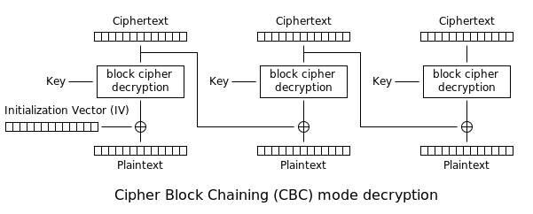

Source : https://en.wikipedia.org/wiki/Block_cipher_mode_of_operation#/media/File:CBC_decryption.svg

The decryption scheme is straightforward. Let **C<sub>i</sub>** and **P<sub>i</sub>** denote the `i-th` ciphertext and plaintext blocks, respectively, and let `D` represent the AES decryption function.(**C<sub>0</sub>** represents the IV in our case we don't have control over it so we start from the index 1) Then, the following relation holds:

For all i in {1..n}:&nbsp;&nbsp;&nbsp;&nbsp;&nbsp;&nbsp;P<sub>i</sub> = C<sub>i-1</sub> ⊕ D(C<sub>i</sub>)&nbsp;&nbsp;&nbsp;&nbsp;&nbsp;&nbsp;**(1)**

(**C<sub>0</sub>** represents the IV. In our case we don't have control over it so we start from the index 1 wich is the first block from the ciphertext) 

Here, "⊕" denotes the XOR operation.

The truth table for XOR is as follows:

| A | B | A XOR B |
|---|---|---------|
| 0 | 0 |    0    |
| 0 | 1 |    1    |
| 1 | 0 |    1    |
| 1 | 1 |    0    |

Now, suppose we have control over **C<sub>i-1</sub>**. To flip (or modify) the `k-th` byte of **P<sub>i</sub>**, we simply alter the `k-th` byte of **C<sub>i-1</sub>**. After the XOR operation, this produces the desired **P<sub>i</sub>** with the byte changed to the value we want.


Source : https://i.sstatic.net/bOu8Q.png

The following question come to mind : How we can choose the new value for the `k-th` byte in the **C<sub>i-1<sub>** since we don't know the value of D(C<sub>i</sub>)?Don't worry I will expalain

We search C'<sub>i-1</sub> such that :

P'<sub>i</sub> = C'<sub>i-1</sub> ⊕ D(C<sub>i</sub>) &nbsp;&nbsp;&nbsp;&nbsp;&nbsp;&nbsp; **(2)**

but from equation **(1)** we have : 

D(C<sub>i</sub>) = C<sub>i-1</sub> ⊕ P<sub>i</sub>

So by substituting in the equation **(2)** we get 

P'<sub>i</sub> = C'<sub>i-1</sub> ⊕ C<sub>i-1</sub> ⊕ P<sub>i</sub>

which gives 

C'<sub>i-1</sub> = P'<sub>i</sub> ⊕ C<sub>i-1</sub> ⊕ P<sub>i</sub> &nbsp;&nbsp;&nbsp;&nbsp;&nbsp;&nbsp; **(3)**

We knew the value of P'<sub>i</sub>(the plaintext we want to get), C<sub>i-1</sub> and P<sub>i</sub>. So we can calculate C'

## Craft the malicious password

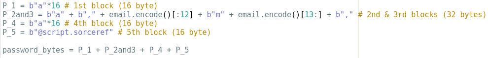

    password = "aaaaaaaaaaaaaaaaa,dojytbjmyt@nmtscript.sorcerer,aaaaaaaaaaaaaaaa@script.sorceref"

This password passes all the tests :  
- Its length is not a multiple of 16  
- The generated email is not part of it, since we replaced the "o" with "m"  
- No "script.sorcerer" exists in it  

I know, I know, you’re probably wondering what this is all about. But in fact, every single detail was added on purpose, and I will explain why in the decryption step.

After I sent the password to the server it gave me this :  

     Encrypted password (hex) : 56f2b9827a8f8318efcabc61266d90939d28a3c5cee5124d53376c29428e00ab92178395ac900206c0db7246fe81a15c7c23be2f00867ea830c248f8b4b65799d46d3cbd9204b6184f0f3fb7d9f947c7

With a length of 80 bytes the same as the length of the plaintext password. So all things go as expected. Now we need to make changes to the ciphertext we get so that after decryption we get a string that ends with "script.sorcerer" and it has the generated email on it. Let's do it.

I created this visualization of the decryption process to give you a clearer understanding of what happened.

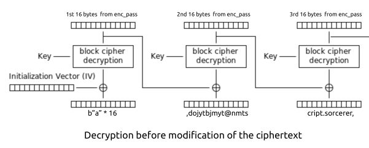 

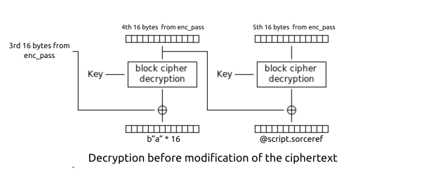  

We encountered issues with two specific bytes:  
1. The **15th byte of the second ciphertext block** (we need to flip `"m"` to `"o"`).  
2. The **last byte of the last ciphertext block** (we need to flip `"f"` to `"r"`).  

- **First case (second block, 15th byte):**  
  We will use the first ciphertext block. According to equation (3):

      New_enc_pass_B1(15) = "m" ⊕ Previous_enc_pass_B1(15) ⊕ "o"

- **Second case (last block, last byte):**  
We will use the fourth ciphertext block. According to equation (3):

      New_enc_pass_B4(16) = "f" ⊕ Previous_enc_pass_B4(16) ⊕ "r"

The following visualizations summarize the result after these modifications:

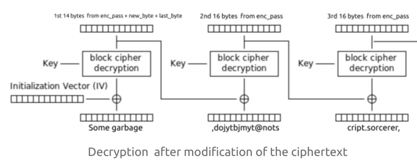

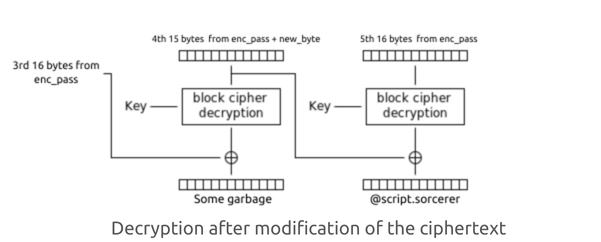

And after decryption we got :

    new_password = "16_byte_of_garbage,dojytbjmyt@notscript.sorcerer,16_bytes_of_garbage@script.sorcerer"

#### Notes 
- Commas are mandatory because when the `send_email` function is called, it splits the input string using commas and then checks whether the generated email exists among the resulting parts. In our case, it certainly does.  

- When I tried to solve the challenge, I first crafted a plaintext (the email might change eventually, but I’ll use the previous email as an example) like this: `aa,dojytbjmyt@nmtscript.sorcerer,aaaaaaaaaaaaaaaa@script.sorceref` I thought to myself: *“Yeah, that’s a 64-byte password and it will work like a charm; I’ll flip the 'm' with the 'a' from the first block and the 'f' with the last 'a' from the fourth block.”* But None of this happened, yet the `send_email` function executed, but the value of the variable `has_flag` never changed. Then came the “Ahah” moment: after decryption, the first block become a garbage because altering the 'a' changed the entire block after decryption (one of the properties of AES). This led to the loss of an email part. So as I said, everything in the payload was done in purpose.

# Implementation

Enough theory.

I added a well-commented Python script to this directory that implements all the theory I explained earlier. It uses pwntools to communicate with the server. Before checking it out, it’s better to understand the theory and try implementing it yourself.

# Final thoughts

EaaS is a type of challenge that pushes you to think outside the box, and that’s the best part: it doesn’t only require technical knowledge to solve, but it also demand analytical and problem-solving skills. I believe that without the assistance of AI, this challenge wouldn’t have reached such a high number of solves (+100).

Many thanks to all the organizers for their tremendous efforts.
