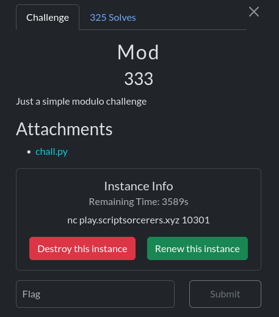
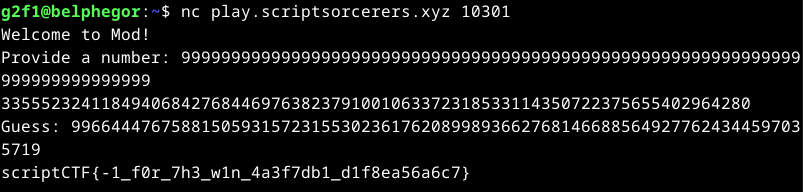

The chall.py conains :

```python
#!/usr/local/bin/python3
import os
secret = int(os.urandom(32).hex(),16)
print("Welcome to Mod!")
num=int(input("Provide a number: "))
print(num % secret)
guess = int(input("Guess: "))
if guess==secret:
    print(open('flag.txt').read())
else:
    print("Incorrect!")
```
they gave us also a server we connect to it using the nc command

First we provide a number(num). The server return num % secret and then asks for the guess of the secret

This is a simple challenge, I just give a number that has slightly more digits to what int(os.urandom(32).hex(),16) gives 



- **Flag** : scriptCTF{-1_f0r_7h3_w1n_4a3f7db1_d1f8ea56a6c7}


