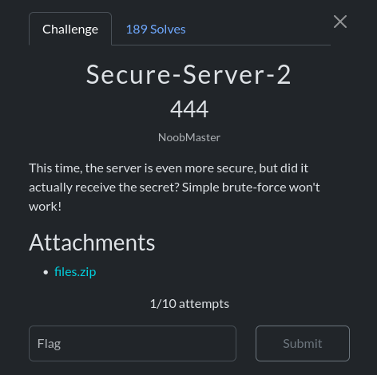

This time, we are provided with three files: capture.pcap, server.py, and john.doe.py.

By analyzing the .pcap file and following the TCP stream, we obtain the following:

```
With the Secure Server 2, sharing secrets is safer than ever! We now support double encryption with AES!
Enter the secret, encrypted twice with your keys (in hex): 19574ac010cc9866e733adc616065e6c019d85dd0b46e5c2190c31209fc57727 // Ek2(Ek1(secret))
Quadriple encrypted secret (in hex): 0239bcea627d0ff4285a9e114b660ec0e97f65042a8ad209c35a091319541837 // Ek4(Ek3(Ek2(Ek1(secret))))
Decrypt the above with your keys again (in hex): 4b3d1613610143db984be05ef6f37b31790ad420d28e562ad105c7992882ff34 Dk2(Dk1(Ek4(Ek3(Ek2(Ek1(secret))))))
Secret received!

```
the server code source:

```python
import os
from Crypto.Cipher import AES
print("With the Secure Server 2, sharing secrets is safer than ever! We now support double encryption with AES!")
enc = bytes.fromhex(input("Enter the secret, encrypted twice with your keys (in hex): ").strip())
# Our proprietary key generation method, used by the server and John Doe himself!
k3 = b'BB' # Obviously not the actual key
k4 = b'B}' # Obviously not the actual key
# flag = secret_message + k1 + k2 + k3 + k4 (where each key is 2 bytes)
# In this case: scriptCTF{testtesttesttesttest!_AAAABBB}
keys = [k3,k4]
final_keys = []
for key in keys:
    assert len(key) == 2 # 2 byte key into binary
    final_keys.append(bin(key[0])[2:].zfill(8)+bin(key[1])[2:].zfill(8))

cipher = AES.new(final_keys[0].encode(), mode=AES.MODE_ECB)
cipher2 = AES.new(final_keys[1].encode(), mode=AES.MODE_ECB)
enc2 = cipher2.encrypt(cipher.encrypt(enc)).hex()
print(f"Quadriple encrypted secret (in hex): {enc2}")
dec = bytes.fromhex(input("Decrypt the above with your keys again (in hex): ").strip())
secret = cipher.decrypt(cipher2.decrypt(dec))
print("Secret received!")
```
So, the flag is split into **five parts**: `secret_message`, `k1`, `k2`, `k3`, and `k4`.  
From the provided Python file, we learn that:  
- The **user** encrypts with `k1` and `k2`.  
- The **server** encrypts with `k3` and `k4`.  

The weakness here lies in the **AES key sizes**:  
- `k1`, `k2`, and `k3` are only **2 bytes** long.  
- `k4` is only **1 byte** long (since the other byte is already known).  

This drastically reduces the key space, making brute force feasible.  

We start with `k1` and `k2`. The encryption scheme is:  

\[
C = E_{k2}(E_{k1}(secret))
\]

We also know that the secret begins with **`scriptCTF`**.  

The following script brute-forces `k1` and `k2`, recovering both the keys and the plaintext:


```python
from Crypto.Cipher import AES
from itertools import product
import string
import sys

# Inner ciphertext from the server
inner_ciphertext_hex = "19574ac010cc9866e733adc616065e6c019d85dd0b46e5c2190c31209fc57727"
inner_ciphertext = bytes.fromhex(inner_ciphertext_hex)

# Known plaintext prefix
KNOWN_PREFIX = b"scriptCTF{"

# Allowed bytes for keys (ASCII letters + digits)
ALPHABET_BYTES = [ord(c) for c in string.ascii_letters + string.digits]

# Convert 2-byte key to AES key (expand to 16 bytes deterministically)
def to_aes_key(two_byte_key):
    return (bin(two_byte_key[0])[2:].zfill(8) + bin(two_byte_key[1])[2:].zfill(8)).encode()

# Brute-force k1 and k2 (each 2 bytes, alphabet only)
for k1_bytes in product(ALPHABET_BYTES, repeat=2):
    for k2_bytes in product(ALPHABET_BYTES, repeat=2):
        k1 = bytes(k1_bytes)
        k2 = bytes(k2_bytes)

        key1_aes = to_aes_key(k1)
        key2_aes = to_aes_key(k2)

        cipher1 = AES.new(key1_aes, AES.MODE_ECB)
        cipher2 = AES.new(key2_aes, AES.MODE_ECB)

        try:
            decrypted = cipher1.decrypt(cipher2.decrypt(inner_ciphertext))
            if decrypted.startswith(KNOWN_PREFIX):
                print(f"k1 = {k1}, k2 = {k2}")
                print(f"Recovered plaintext: {decrypted}")
                sys.exit(0)
        except Exception:
            continue

print("No matching keys found.")

```
For `k3` and `k4`, I applied the same brute-force logic.  
The difference is that `k4` has a **fixed part**, which must contain the closing brace "`}`".  

At this stage, the encryption flow looks like this:  

\[
C = E_{k4}(E_{k3}(E_{k2}(E_{k1}(secret))))
\]

So, during decryption, we try:  

\[
P = D_{k1}(D_{k2}(D_{k3}(D_{k4}(C))))
\]

To validate our result, we check whether the intermediate decryption produces a string starting with **`19574ac010`** (the first hex digits of `E_{k2}(E_{k1}(secret))`).  
If this condition is satisfied, then we have successfully found `k3` and `k4`. ✅

```python
from Crypto.Cipher import AES
from itertools import product
import string
import sys
# Inner ciphertext from the server
inner_ciphertext_hex = "0239bcea627d0ff4285a9e114b660ec0e97f65042a8ad209c35a091319541837"
inner_ciphertext = bytes.fromhex(inner_ciphertext_hex)

# Known plaintext prefix
KNOWN_PREFIX = bytes.fromhex("19574ac010")

# Allowed bytes for keys (ASCII letters only)
ALPHABET_BYTES = [ord(c) for c in string.ascii_letters+string.digits]

# Convert 2-byte key to AES key
def to_aes_key(two_byte_key):
    return (bin(two_byte_key[0])[2:].zfill(8) + bin(two_byte_key[1])[2:].zfill(8)).encode()

# Brute-force k1 and k2 (each 2 bytes, alphabet only)
for k3_bytes in product(ALPHABET_BYTES, repeat=2):
    for k4_bytes in product(ALPHABET_BYTES, repeat=1):

        k3 = bytes(k3_bytes)

        k4 = bytes(k4_bytes)+b'}'

        key3_aes = to_aes_key(k3)
        key4_aes = to_aes_key(k4)

        cipher3 = AES.new(key3_aes, AES.MODE_ECB)
        cipher4 = AES.new(key4_aes, AES.MODE_ECB)

        try:
            decrypted = cipher3.decrypt(cipher4.decrypt(inner_ciphertext))
            if decrypted.startswith(KNOWN_PREFIX):
                print(f"k3 = {k3}, k4 = {k4}")
                sys.exit(0)
        except Exception:
            continue

print("No matching keys found.")

```
Finally conctanating all the parts gives the flag 

- **Flag** : scriptCTF{s3cr37_m3ss4g3_1337!_7e4b3f8d}
