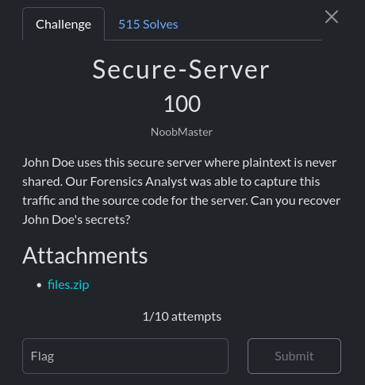

We get zip files that contains two files : server.py and capture.pcap

the server.py file contains :

```python
import os
from pwn import xor
print("With the Secure Server, sharing secrets is safer than ever!")
enc = bytes.fromhex(input("Enter the secret, XORed by your key (in hex): ").strip())
key = os.urandom(32)
enc2 = xor(enc,key).hex()
print(f"Double encrypted secret (in hex): {enc2}")
dec = bytes.fromhex(input("XOR the above with your key again (in hex): ").strip())
secret = xor(dec,key)
print("Secret received!")
```

After following the tcp stream in the pcap file we get this : 

```
With the Secure Server, sharing secrets is safer than ever!
Enter the secret, XORed by your key (in hex): 151e71ce4addf692d5bac83bb87911a20c39b71da3fa5e7ff05a2b2b0a83ba03 // this is t1 = secret^K  with K is the key of the user
Double encrypted secret (in hex): e1930164280e44386b389f7e3bc02b707188ea70d9617e3ced989f15d8a10d70 // this is t2 = secret^K^key 
XOR the above with your key again (in hex): 87ee02c312a7f1fef8f92f75f1e60ba122df321925e8132068b0871ff303960e // this is t3 = secret^key
Secret received!
```
This challenge is also easy we just apply the caracterstics of the xor operation to get the secret which is the flag

t1^t2^t3 = secret^K^secret^K^key^secret^key = secret

the final script :

```python
from pwn import xor 
t1=bytes.fromhex("151e71ce4addf692d5bac83bb87911a20c39b71da3fa5e7ff05a2b2b0a83ba03")
t2=bytes.fromhex("e1930164280e44386b389f7e3bc02b707188ea70d9617e3ced989f15d8a10d70")
t3=bytes.fromhex("87ee02c312a7f1fef8f92f75f1e60ba122df321925e8132068b0871ff303960e")

print(xor(xor(t1,t2),t3).decode())

```
- **Flag** : scriptCTF{x0r_1s_not_s3cur3!!!!}
